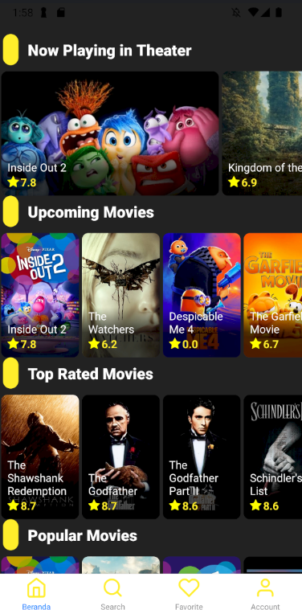

# Movie App (React Native with Expo)





This application is an example of a React Native app using Expo to facilitate cross-platform development and deployment.

## Features

- Login Form: Secure access to user accounts.
- Latest Movies List: Display the newest releases.
- Movie Search: Find movies by title.
- Detailed Movie View: Explore synopsis, rating, and more.
- Favorites: Save favorite movies for quick access.
- Account Menu: Manage user profile and settings.

## Technology Stack

- React Native
- Expo
- React Navigation for navigation between screens

## Installation

Make sure you have Node.js and Expo CLI installed on your system. Then, follow these steps:

1. Clone the repository:

   ```bash
   git clone https://github.com/MovieAppProgate/Kelompok9_MovieApp
   
   cd movie-app

2. Install dependencies:
   ```bash
   npm install
   
4. Start the application:
   ```bash
   npm start
   
 Or
   
4. Open the Expo Go app on your device or emulator to view the app.

## Contributing

Contributions in the form of pull requests are welcome. For major changes, please open an issue first to discuss what you would like to change.

## License

[MIT](LICENSE)

## Download Aplication
         ``bash
         https://s.id/MovieProgate9

---

Created with ❤️ by Kelompok 9 Progate
   
   

   
